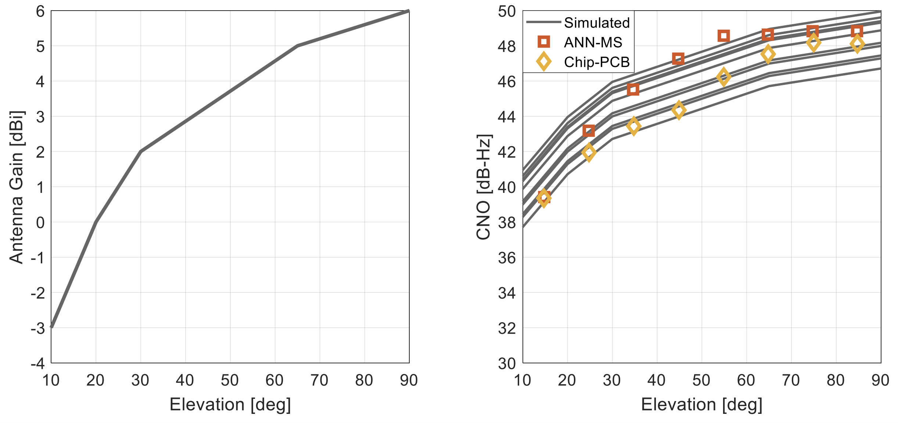

## GNSS Measurement Simulator
The GNSS measurement simulator is used to generate raw GNSS observables from an input file containing the simulated navigation solution of the receiver and an associated ephemeris file retrievied from CDDIS. The GNSS measurement simulator then uses this information to generate raw GNSS observables.

## Measurement Models

In the simulator, for a given frequency band `i` (here eliminated for brevity) the pseudorange $P_r^s$, Doppler frequency $D_r^s$, and carrier phase (given as phase range) measurements between a satellite `s` and a receiver `r` are given by:

$P_r^s = \rho_r^s + c(dt_r(t_r)-dT_s(T_s))+I_r^s + T_r^s + M_P + \epsilon(\rho)$

$D_r^s = -\frac{fi}{c} \left([v_{es}^e(T_s) - v_{er}^e(t_r)]^T \cdot e_r^s + c\left( \frac{\partial t_r(t_r)}{\partial t} - \frac{\partial T_s(T_s)}{\partial t} \right) + \dot{I}_r^s + \dot{T}_r^s \right)  + \epsilon(f_D)$

$\Phi_r^s = \rho_r^s + c(dt_r(t_r)-dT_s(T_s)) - I_r^s + T_r^s + \lambda (\delta\phi + N_r^s) +\epsilon(\Phi)$

where:

$\rho_r^s$ - Geometric range from the receiver to the satellite [m]

$dt_r(t_r)$ - Receiver clock offset at signal reception time [s]

$dT_s(T_s)$ - Satellite clock offset at signal transmission time [s]

$I_r^s$ - Ionospheric delay [m]

$T_r^s$ - Tropospheric delay [m]

$\delta\phi = \phi_{r,0} - \phi_{s,0}$ 

$N_r^s$ - Integer ambiguity term

$\epsilon(\rho)$ - Random thermal noise in range measurements [m]

$\epsilon(f_D)$ - Includes multipath effects and random noise in Doppler measurements [Hz]

$\epsilon(\Phi)$ - In addition to carrier phase noise, this terms also admits satellites and receiver's antenna phase centre offset and variation, any receiver  displacement due to earth tides, and phase wind-up

The `measurement generation` mechanism is shown in the figure below:

## Carrier power to noise density
In addition to the measurements above, the simulator also outputs the `carrier power to noise density ratio` given by:

$C/N_0 = P_r + G_a - N_0 + \epsilon(C/N_0)$

where:

$P_r$ - is the received signal power from a satellite at the antenna input [dBW]

$N_0$ - is the thermal noise power component in a 1-Hz bandwidth [dBW]

$G_a$ - is the antenna gain toward a satellite [dBic]

Further, the thermal noise power is modelled using:

$N_0 = 10\cdot log_{10}(k\cdot(T_{ant} + T_{amp}))$

where:

$T_{ant}$ - antenna equivalent noise temperature ~ $100 K$

$T_{amp}$ - is the amplifier noise temperature [K] that is determined from the amplifier noise figure $`N_f`$

$k$ -  is the `Boltzmann's` constant

In the simulator, the $C/N_0$ measurements for a particular satellite will vary depending on the satellite elevation angle due to differences in path loss and the satellite and receiver gain pattern [1]. The `antenna gain variation with satellite elevation angle` for the simulated receiver is shown in the figure below. And the $C/N_0$ realisations are also shown for the simulated receiver.

## Thermal Noise

In the simulator, thermal noise affecting the pseudorange measurements is modelled as white noise with a standard deviation varying with the carrier power to noise density ratio. This is given by:

$\epsilon(\rho) = N(0,\sigma_e^2(C/N_0))$

$\sigma_e = b_0 + b_1\cdot\exp(-\frac{C/N_0-b_2}{b_3})$

Results using the model above are shown in the figure below. The figure shows the multiconstellation pseudorange noise obtained using Hatch filter residuals from multiconstellation dataset.

## Other Models

For a detailed description of other error models including: 
* Residual `Ionospheric` error model
* Residual `Tropospheric` error model 
* `Multipath` model
* `Receiver clock` error model

The user is directed to [1] and [2]. 

## Usage

1. To fetch ephemeris files, it is recommended to use the `fetch.py` script. This will store any retrieved files in the CDDIS folder. For additional information, please refer to [Fetching files](./matlab/CDDIS/README.md)

## References
[1] Mwenegoha, H. A., Moore, T., Pinchin, J. and Jabbal, M. (2020) ‘A Model-based
Tightly Coupled Architecture for Low-Cost Unmanned Aerial Vehicles for
Real-Time Applications’, IEEE Access.

[2] Mwenegoha, H. A., Moore, T., Pinchin, J. and Jabbal, M. (2019) ‘Enhanced Fixed
Wing UAV Navigation in Extended GNSS Outages using a Vehicle Dynamics
Model and Raw GNSS Observables’, in Proceedings of the 32nd International
Technical Meeting of the Satellite Division of The Institute of Navigation (ION
GNSS+ 2019). Miami, Florida, pp. 2552–2565.
